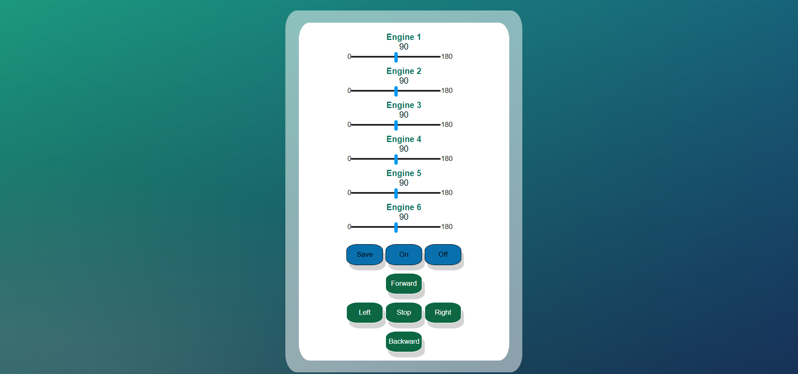

# Login_Page
Design login and sign up pages
for the login page i created text fields for SSID and passwords with two buttons one to sign in and the other one to sign up.
* if the user pressed sign in the contents of the text fields will be compared with SSID AND PASSWORD variables to check if they are correct the user will be directed to engines page otherwise a warning alert will appear to the user to indicate that the SSID or the password is wrong.
* if the user presses sign up button the user will be directed to a sign up page where the user must fill in the required information and then will be redirected to the sign in page again.

  
  
  

